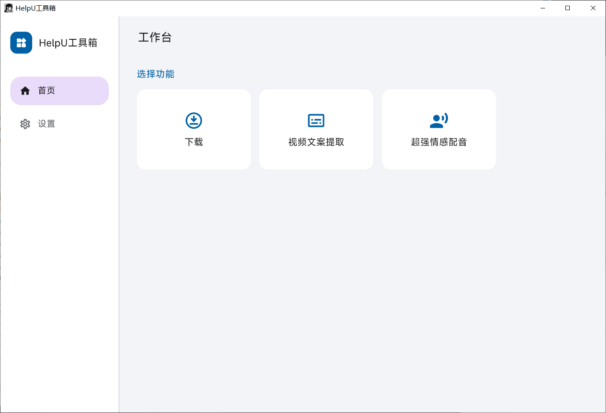
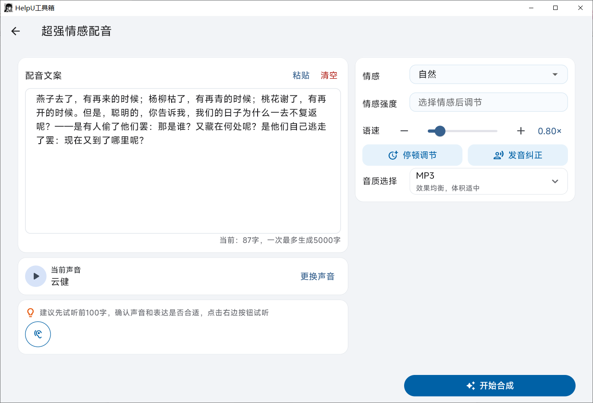
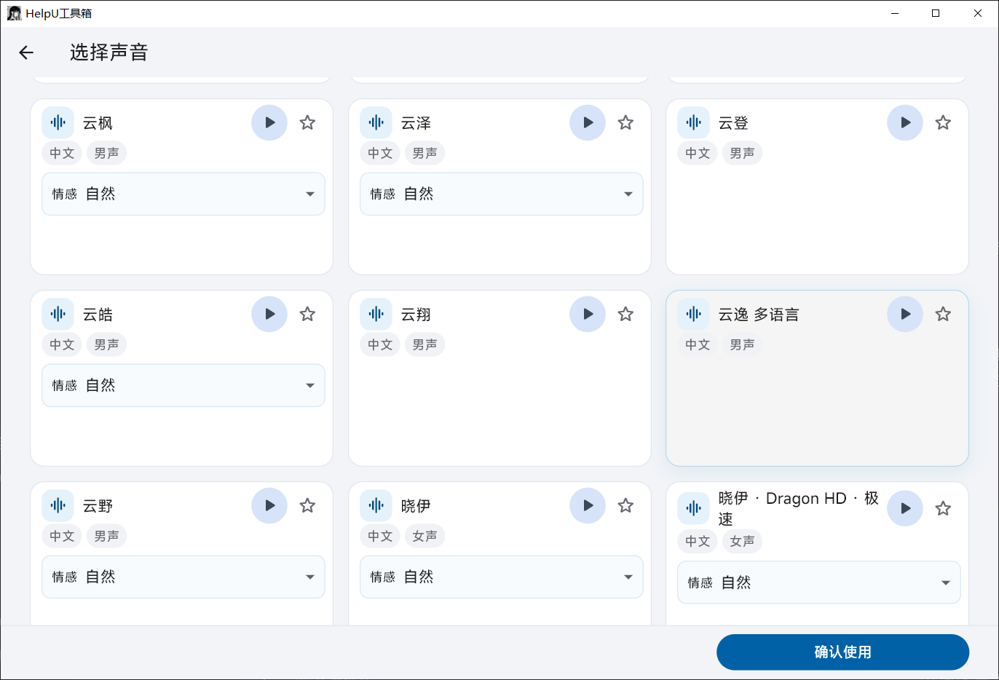
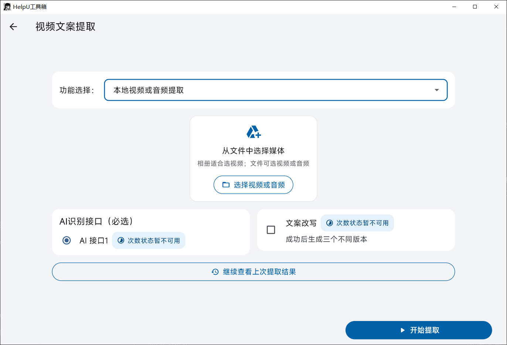

# 免费配音,超强情感配音,文案提取,去水印下载

HelpU 工具箱是一款面向 Windows 与 Android 的实用工具。当前提供以下功能：

- 免费配音：将文案转换为语音，便于快速试听与使用。
- 超强情感配音：可选择音色、情感、语速与音质，生成更有表现力的配音内容。
- 文案提取：从视频、音频或链接内容中提取文案，支持后续整理使用。
- 去水印下载：解析并下载视频与图文作品，保存到本机。

## 软件界面

## 下载

请前往 [Releases](../../releases/latest) 下载最新版本。

- Windows：下载 `helpu-windows-1.0.18-26.zip`，完整解压后运行 `helpu_toolbox.exe`。
- Android：下载 `helpu-android-1.0.18-26.apk`，支持 Android 8.0 及以上的 64 位 ARM 设备。

Windows 版本为便携压缩包。当前未购买商业代码签名证书，首次运行时 Windows 可能显示安全提醒。

本仓库仅提供 HelpU 软件成品下载，不开放源代码。